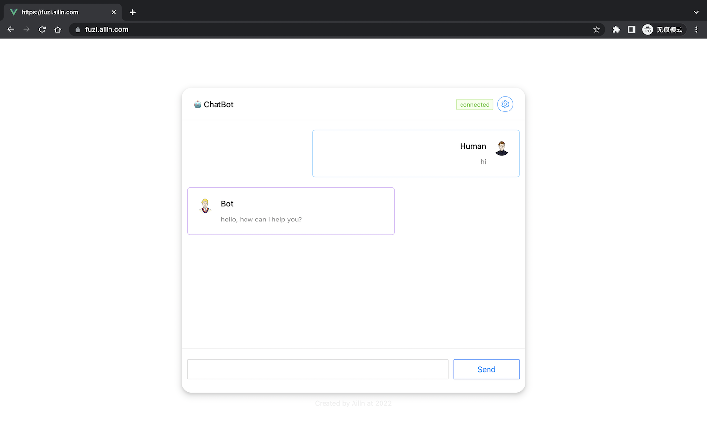

# fuzi nlu

[](https://github.com/Ailln/fuzi-nlu/blob/master/LICENSE)
[](https://github.com/Ailln/fuzi-nlu/stargazers)
[](https://github.com/Ailln/fuzi-nlu/network/members)

🤖️ 聊天机器人——`夫子`的「自然语言理解」模块。

## 1 简介

`夫子` 聊天机器人有 5 个模块组成：
1. [fuzi-view](https://github.com/Ailln/fuzi-view): 聊天界面模块，与用户进行交互。
2. [fuzi-nlu](https://github.com/Ailln/fuzi-nlu): 自然语言处理模块，理解用户的问题。
3. fuzi-core: 对话管理模块，推断用户的意图。
4. fuzi-admin: 后台管理模块，管理机器人的设置。
5. fuzi-mark: 数据标注模块，标注用户的问题。

常见地聊天机器人有两种：

1. 闲聊型 `open domain`
2. 任务型 `task oriented`

本项目属于第二种，即面向任务的聊天机器人。这类型机器人的常见应用是智能客服，**目的是为了解决用户的明确需求**。


上图为面向任务的聊天机器人的一般流程，该项目目前实现了第一部分的 `NLU` 功能，包含 `Slot Filling` 和 `Intent Prediction`。

## 2 预览



[>> 点我立即尝试 <<](https://fuzi.ailln.com)

## 3 数据

### 3.1 数据集

1. `guotie`：这份数据集的主要内容是关于我家🐱`锅贴`，只使用了意图识别的功能。
2. `weather`: 在 Github 上找到的一份关于天气的 [中文公开数据集](https://github.com/howl-anderson/NLU_benchmark_dataset/tree/master/dataset/dialogflow/weather/rasa_format) 。
3. `fewjoint`: [SMP2020](https://atmahou.github.io/attachments/FewJoint.zip) 。

### 3.2 数据标注

这里使用 RASA 开源的标注工具 [RASA-NLU-Trainer](https://github.com/RasaHQ/rasa-nlu-trainer) 进行标注。

> 我自己部署了一份在线上，可以[直接使用](https://chatbot.dovolopor.com/labeling/) 。

标注完成后需要进行格式转化才能使用，这里以 `/back/data/guotie.json` 为例：

```bash
pip install rasa==2.6.3

cd fuzi-nlu/data
mkdir guotie

# rasa 暂时不支持从 json 直接转成 yaml，因此需要先转 md，再转 yaml
rasa data convert nlu -f md --data guotie.json --out ./guotie/nlu.md
rasa data convert nlu -f yaml --data ./guotie/nlu.md --out ./guotie/

rm ./guotie/nlu.md
mv ./guotie/nlu_converted.yml ./guotie/nlu.yml

# 生成 domain
python -m run.generate_domain_from_nlu --nlu ./data/guotie/nlu.yml --domain ./data/guotie/domain.yml
```

## 4 快速上手

```shell
git clone https://github.com/Ailln/fuzi-nlu.git

cd fuzi-nlu
# 安装依赖
pip install -r requirements.txt

python -m run.aiohttp_server
```

## 5 部署

### 5.1 Docker

```shell
git clone https://github.com/Ailln/fuzi-nlu.git

# in amd64
cd fuzi-nlu
# 打包
docker build -t fuzi-nlu:1.0.0 .
# 运行
docker run -d --restart=always --name fuzi-nlu -p 8080:8080 fuzi-nlu:1.0.0

# in arm64
cd fuzi-nlu
# 打包
docker build -t fuzi-nlu:1.0.0 -f deploy/arm64.Dockerfile .
# 运行
docker run -d --restart=always --name fuzi-nlu -p 8080:8080 fuzi-nlu:1.0.0
```

### 5.2 Kubernetes

```shell
cd fuzi-nlu
# 准备好镜像
kubectl apply -f deploy/deployment.yaml
```

## 6 其他

### 6.1 重新训练模型

```shell
cd fuzi-nlu
# 训练
python -m run.train

# 测试
python -m run.test
```

### 6.2 QPS Test

```shell
pip install locust

locust -f test/qps_test.py -H http://127.0.0.1:8080 -u 10 -r 2
# 打开 http://0.0.0.0:8089
```

## 7 参考

- [Tensorflow动态seq2seq使用总结（r1.3）](https://github.com/applenob/RNN-for-Joint-NLU/blob/master/tensorflow_dynamic_seq2seq.md)
- [Attention-Based Recurrent Neural Network Models for Joint Intent Detection and Slot Filling](https://arxiv.org/abs/1609.01454)
- [BERT for Joint Intent Classification and Slot Filling](https://arxiv.org/pdf/1902.10909.pdf)
- [从“连接”到“交互”—阿里巴巴智能对话交互实践及思考](https://yq.aliyun.com/articles/144035)
- [A Frustratingly Easy Approach for Joint Entity and Relation Extraction](https://arxiv.org/pdf/2010.12812.pdf)
- [FewJoint: A Few-shot Learning Benchmark for Joint Language Understanding](https://arxiv.org/abs/2009.08138)

## 8 许可证

[](./LICENSE)
[](https://github.com/Ailln/award)

## 9 交流

请添加微信号：`Ailln_`，备注「fuzi」，我邀请你进入交流群。
